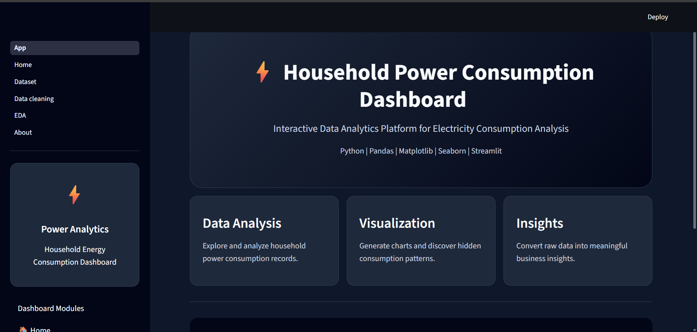

# ⚡ Household Power Consumption Analysis Dashboard

A professional **Data Analytics Dashboard** built using **Python, Pandas, Streamlit, Matplotlib, Seaborn, and Plotly** to analyze household electricity consumption and generate meaningful insights through interactive visualizations.

---

## 🚀 Live Demo

🔗 **Live Dashboard:** https://household-power-consumption-analysis-spapppjxfnjeirg2jahvfhf.streamlit.app/

📂 **GitHub Repository:** https://github.com/Pawanlokhande-22/Household-Power-Consumption-Analysis

---

## 📸 Dashboard Preview



---

# 📖 Project Overview

This project analyzes household electricity consumption data and provides an interactive dashboard for exploring power usage patterns, identifying trends, and generating business insights.

The dashboard includes:

- 📊 Interactive Dashboard
- 📈 Exploratory Data Analysis (EDA)
- 🧹 Data Cleaning
- 📋 Dataset Analysis
- 📉 Statistical Summary
- 📊 Interactive Charts
- 💡 Business Insights

---

# 🛠️ Tech Stack

- Python
- Pandas
- NumPy
- Matplotlib
- Seaborn
- Plotly
- Streamlit
- OpenPyXL

---

# 📂 Project Structure

```
Household-Power-Consumption-Analysis
│
├── App.py
├── requirements.txt
├── style.css
├── README.md
├── Cleaned_Household_Power_Consumption.xls
├── Filtered_Dataset.csv
│
├── pages
│   ├── 1_Home.py
│   ├── 2_Dataset.py
│   ├── 3_Data_cleaning.py
│   ├── 4_EDA.py
│   └── 5_About.py
│
└── Screenshots
    └── Screenshot.png
```

---

# ✨ Features

✅ Professional Home Dashboard

✅ Dataset Overview

✅ Data Cleaning Module

✅ Exploratory Data Analysis

✅ Interactive Visualizations

✅ Statistical Analysis

✅ Business Insights

✅ Modern UI using Streamlit

---

# 📊 Dashboard Modules

🏠 Home

📊 Dataset Analysis

📈 EDA Visualization

🧹 Data Cleaning

👨‍💻 About Project

---

# 📌 Project Workflow

```
Raw Dataset
      │
      ▼
Data Cleaning
      │
      ▼
Data Preprocessing
      │
      ▼
Exploratory Data Analysis
      │
      ▼
Data Visualization
      │
      ▼
Interactive Dashboard
      │
      ▼
Business Insights
```

---

# 📈 Key Insights

- Analyzed household electricity consumption patterns.
- Identified power usage trends.
- Built interactive visual dashboards.
- Performed data cleaning and preprocessing.
- Generated meaningful analytical insights.

---

# 🎯 Skills Demonstrated

- Data Analysis
- Data Cleaning
- Data Visualization
- Exploratory Data Analysis
- Dashboard Development
- Python Programming
- Streamlit Development
- Business Analytics

---

# ▶️ Installation

Clone the repository

```bash
git clone https://github.com/Pawanlokhande-22/Household-Power-Consumption-Analysis.git
```

Move into project

```bash
cd Household-Power-Consumption-Analysis
```

Install dependencies

```bash
pip install -r requirements.txt
```

Run the application

```bash
streamlit run App.py
```

---

# 👨‍💻 Author

## Pawan Lokhande

🎓 B.Tech – Computer Science & Engineering (Data Science)

### Connect with Me

- GitHub: https://github.com/Pawanlokhande-22
- LinkedIn: *(Add your LinkedIn profile link here)*

---

## ⭐ If you like this project, don't forget to Star this repository!
